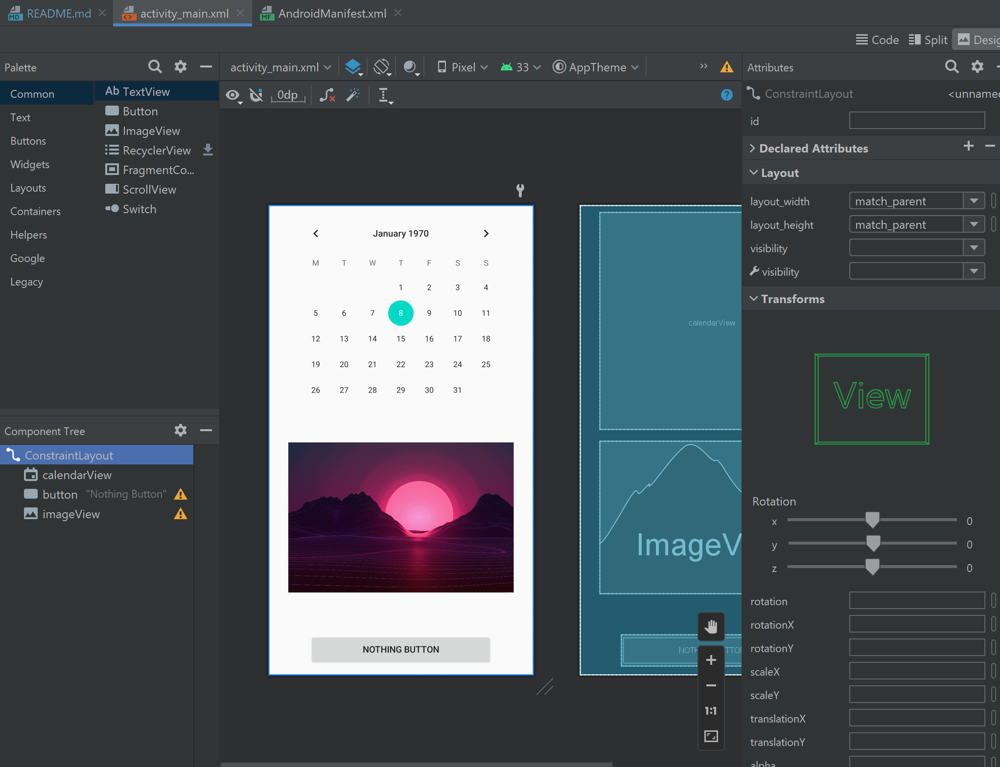

# Rapport

Uppgift 3 handlar om att lägga till Widgets i den utvalda layout (`LinearLayout` or `ConstraintLayout`).

I detta uppgift användes det den default layout som är ConstraintLayout och seda i den var 3 widgets tillagda.
```
<androidx.constraintlayout.widget.ConstraintLayout xmlns:android="http://schemas.android.com/apk/res/android"

...

</androidx.constraintlayout.widget.ConstraintLayout>
```

Alla widgets var implementerade genom den grafiska miljö som finns i Android Studio (se bild 1.).
Ändringar gjordes i activity_main.xml i "Design" tab. 
Varje widget är kopplad till layout och har egna "margins".


Bilder:

'Bild 1: Design view in Android Studio'


'Bild 2: Screen from emulator of running app'


